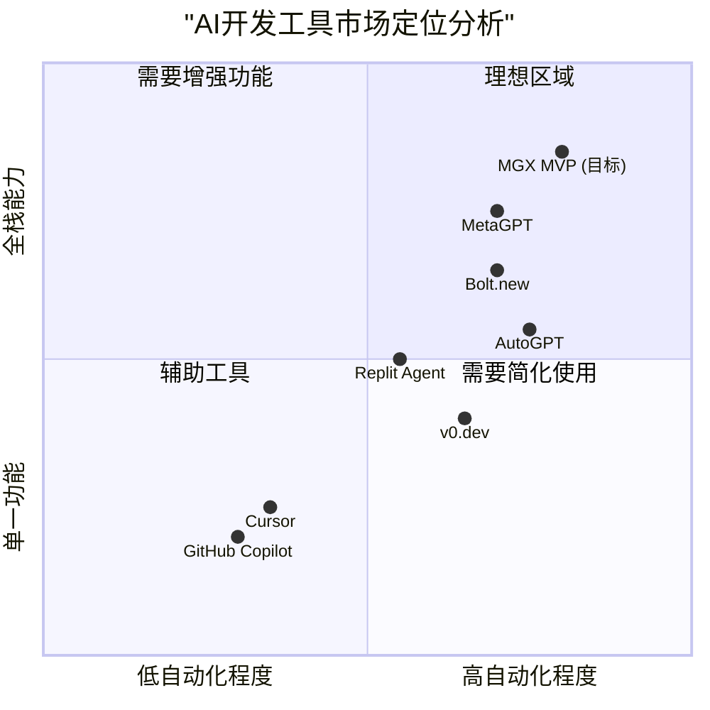
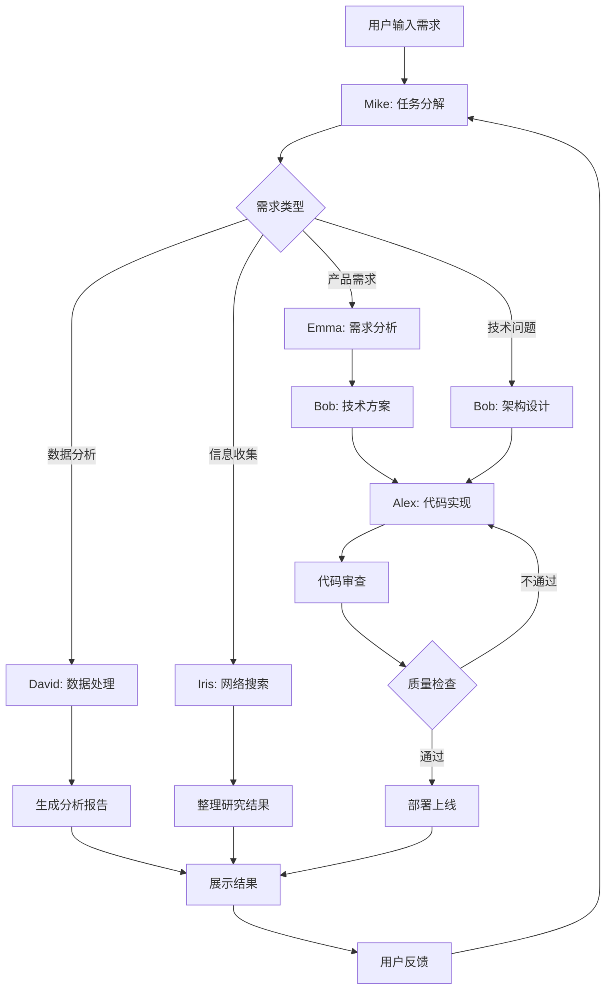
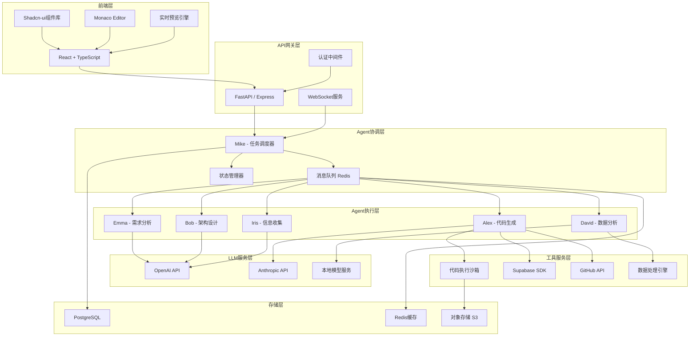

# MGX MVP系统 - 产品需求文档 (PRD)

## 1. 项目基本信息

### 1.1 语言与技术栈
- **文档语言**: 中文
- **编程语言**: 
  - 前端: TypeScript, React, Shadcn-ui, Tailwind CSS
  - 后端: Python (FastAPI), Node.js
  - Agent框架: LangChain/AutoGPT/MetaGPT
- **项目名称**: mgx_mvp_system

### 1.2 原始需求重述
用户希望构建一个AI智能团队系统（MGX MVP），该系统能够像一个完整的开发团队一样协同工作。系统包含六个专业Agent角色，能够处理从需求分析到代码部署的完整开发流程。系统由Agent服务端和前端交互界面两部分组成，支持前端网页开发、后端集成、数据分析、版本控制等核心功能。

---

## 2. 产品定义

### 2.1 产品目标

1. **降低开发门槛**: 让非技术用户也能通过自然语言描述需求，快速生成可用的Web应用
2. **提升开发效率**: 通过多Agent协作，将传统需要数天的开发工作压缩到分钟级别
3. **保证代码质量**: 通过架构师和工程师Agent的协作，确保生成的代码具有良好的架构和可维护性

### 2.2 用户故事

1. **作为创业者**, 我希望能够快速将产品想法转化为可演示的MVP原型，以便验证市场需求和获取早期用户反馈
2. **作为独立开发者**, 我希望系统能帮我处理繁琐的架构设计和代码编写工作，让我专注于核心业务逻辑和创意实现
3. **作为产品经理**, 我希望能够直接与AI团队沟通需求，获得专业的市场分析和技术可行性评估
4. **作为数据分析师**, 我希望系统能自动处理数据清洗和可视化工作，快速生成分析报告
5. **作为学习者**, 我希望通过观察AI团队的协作过程，学习专业的软件开发流程和最佳实践

### 2.3 竞品分析

| 产品名称 | 优势 | 劣势 |
|---------|------|------|
| **Cursor** | AI代码补全精准，IDE集成度高，支持多种编程语言 | 需要开发者具备编程基础，无多Agent协作，不支持端到端开发 |
| **v0.dev (Vercel)** | 快速生成React组件，UI质量高，与Next.js深度集成 | 仅限前端开发，无后端支持，缺少团队协作概念 |
| **Bolt.new** | 全栈开发支持，实时预览，部署便捷 | 单一AI模型，无角色分工，复杂项目处理能力有限 |
| **GitHub Copilot** | 代码建议准确，IDE集成广泛，学习成本低 | 被动辅助工具，无主动规划能力，不支持完整项目生成 |
| **Replit Agent** | 云端开发环境，支持协作，多语言支持 | Agent能力单一，无专业角色分工，项目管理功能弱 |
| **AutoGPT** | 自主任务规划，可扩展插件系统 | 用户界面简陋，稳定性不足，缺少专业开发工具集成 |
| **MetaGPT** | 多Agent协作框架，模拟软件公司流程 | 主要面向开发者，学习曲线陡峭，缺少友好的用户界面 |

### 2.4 竞品象限图



---

## 3. 技术规格说明

### 3.1 需求分析

#### 3.1.1 核心功能需求

**A. 多Agent智能团队系统**
- **必须(P0)**: 实现六个专业Agent角色的基础能力
- **必须(P0)**: Agent之间的任务协调和消息传递机制
- **应该(P1)**: Agent工作状态的实时可视化
- **可以(P2)**: Agent能力的动态扩展和自定义

**B. 前端网页开发能力**
- **必须(P0)**: 支持基础的静态网页生成（HTML/CSS/JS）
- **必须(P0)**: 实时预览功能
- **应该(P1)**: 支持React组件化开发
- **应该(P1)**: 响应式设计自动适配
- **可以(P2)**: 支持Vue、Angular等其他框架

**C. 后端集成能力**
- **必须(P0)**: Supabase基础集成（数据库、认证）
- **应该(P1)**: RESTful API自动生成
- **应该(P1)**: 无服务器函数支持
- **可以(P2)**: 支持其他BaaS平台（Firebase、AWS Amplify）

**D. 数据科学能力**
- **必须(P0)**: 基础数据清洗和处理
- **必须(P0)**: 常用图表可视化（折线图、柱状图、饼图）
- **应该(P1)**: 数据分析报告自动生成
- **可以(P2)**: 机器学习模型训练和预测

**E. 版本控制能力**
- **必须(P0)**: 代码文件的本地保存和导出
- **应该(P1)**: GitHub/GitLab自动提交
- **应该(P1)**: 版本历史和回滚功能
- **可以(P2)**: 分支管理和合并冲突处理

**F. 用户交互界面**
- **必须(P0)**: 自然语言需求输入
- **必须(P0)**: Agent工作过程实时展示
- **必须(P0)**: 代码编辑器和预览窗口
- **应该(P1)**: 项目管理和历史记录
- **可以(P2)**: 协作功能和分享机制

#### 3.1.2 非功能性需求

**性能要求**
- 简单页面生成响应时间 < 30秒
- 复杂全栈应用生成时间 < 3分钟
- 前端界面交互延迟 < 200ms
- 支持至少50个并发用户

**可靠性要求**
- 系统可用性 > 99%
- Agent任务失败自动重试机制
- 完善的错误日志和监控

**安全性要求**
- 用户数据加密存储
- API密钥安全管理
- 代码执行沙箱隔离
- 防止恶意代码注入

**可扩展性要求**
- 模块化架构设计
- 支持新Agent角色的插件式添加
- 支持新编程语言和框架的扩展

### 3.2 需求池

| 需求ID | 需求描述 | 优先级 | 实现难度 | 预计工期 |
|--------|---------|--------|----------|----------|
| REQ-001 | Mike Agent: 任务分解和调度 | P0 | 高 | 2周 |
| REQ-002 | Emma Agent: 需求分析和PRD生成 | P0 | 中 | 1周 |
| REQ-003 | Bob Agent: 系统架构设计 | P0 | 高 | 2周 |
| REQ-004 | Alex Agent: 代码生成和部署 | P0 | 高 | 3周 |
| REQ-005 | David Agent: 数据分析基础能力 | P0 | 中 | 1.5周 |
| REQ-006 | Iris Agent: 网络信息收集 | P0 | 中 | 1.5周 |
| REQ-007 | Agent间通信协议设计 | P0 | 高 | 1周 |
| REQ-008 | LLM集成层（支持多模型） | P0 | 中 | 1周 |
| REQ-009 | 前端聊天交互界面 | P0 | 中 | 2周 |
| REQ-010 | 代码编辑器集成（Monaco Editor） | P0 | 低 | 3天 |
| REQ-011 | 实时预览窗口（iframe沙箱） | P0 | 中 | 1周 |
| REQ-012 | Supabase基础集成 | P0 | 中 | 1周 |
| REQ-013 | 静态网页生成能力 | P0 | 低 | 3天 |
| REQ-014 | React组件生成能力 | P1 | 中 | 1周 |
| REQ-015 | 项目文件管理系统 | P1 | 中 | 1周 |
| REQ-016 | GitHub自动提交功能 | P1 | 中 | 1周 |
| REQ-017 | 数据可视化图表库集成 | P1 | 低 | 3天 |
| REQ-018 | Agent工作流可视化 | P1 | 中 | 1周 |
| REQ-019 | 用户认证和项目管理 | P1 | 中 | 1周 |
| REQ-020 | 版本历史和回滚 | P1 | 中 | 1周 |
| REQ-021 | 多语言支持框架 | P2 | 高 | 2周 |
| REQ-022 | Agent能力自定义和扩展 | P2 | 高 | 2周 |
| REQ-023 | 协作和分享功能 | P2 | 中 | 1.5周 |
| REQ-024 | 移动端适配 | P2 | 中 | 1周 |

### 3.3 UI设计草图

#### 3.3.1 主界面布局

```
+----------------------------------------------------------+
|  [Logo] MGX MVP                    [用户] [设置] [帮助]   |
+----------------------------------------------------------+
|                                                           |
|  +------------------+  +------------------------------+   |
|  |  项目列表        |  |  Agent团队状态面板           |   |
|  |                  |  |  [Mike] 协调中...            |   |
|  |  > 我的作品集    |  |  [Emma] 分析需求完成 ✓       |   |
|  |  > 博客系统      |  |  [Bob]  设计架构中...        |   |
|  |  > 电商网站      |  |  [Alex] 等待中               |   |
|  |  + 新建项目      |  |  [David] 等待中              |   |
|  |                  |  |  [Iris] 等待中               |   |
|  +------------------+  +------------------------------+   |
|                                                           |
|  +-------------------------------------------------------+|
|  |  对话输入区                                           ||
|  |  [请描述你的需求...]                    [发送] [附件] ||
|  +-------------------------------------------------------+|
|                                                           |
|  +------------------+  +------------------------------+   |
|  |  对话历史        |  |  代码编辑器                  |   |
|  |                  |  |                              |   |
|  |  用户: 创建...   |  |  [文件树]  [代码区]          |   |
|  |  Mike: 收到...   |  |                              |   |
|  |  Emma: 分析...   |  |                              |   |
|  |                  |  |                              |   |
|  +------------------+  +------------------------------+   |
|                                                           |
|  +-------------------------------------------------------+|
|  |  预览窗口                                             ||
|  |  [刷新] [全屏] [移动端视图] [部署]                    ||
|  |  +--------------------------------------------------+ ||
|  |  |  [网页预览区域]                                  | ||
|  |  |                                                  | ||
|  |  +--------------------------------------------------+ ||
|  +-------------------------------------------------------+|
+----------------------------------------------------------+
```

#### 3.3.2 Agent工作流程图



### 3.4 待解决问题

1. **LLM选型和成本控制**
   - 使用哪些LLM模型？（GPT-4、Claude、开源模型组合？）
   - 如何平衡性能和成本？
   - 是否需要模型微调？

2. **Agent协作机制**
   - 采用什么样的多Agent框架？（LangChain、AutoGen、自研？）
   - 如何处理Agent之间的冲突和死锁？
   - 如何保证Agent决策的可解释性？

3. **代码执行安全**
   - 如何隔离用户生成的代码执行环境？
   - 如何防止恶意代码和资源滥用？
   - 是否需要代码审核机制？

4. **扩展性设计**
   - 如何设计插件系统以支持新Agent？
   - 如何支持用户自定义Agent能力？
   - 如何处理不同编程语言的工具链集成？

5. **用户体验优化**
   - 如何让非技术用户理解Agent的工作过程？
   - 如何处理长时间任务的用户等待体验？
   - 如何设计直观的错误提示和修复建议？

6. **数据持久化和隐私**
   - 用户项目数据存储在哪里？
   - 如何保护用户的代码和数据隐私？
   - 是否支持私有化部署？

---

## 4. 技术架构建议

### 4.1 系统架构图



### 4.2 技术栈选型

#### 前端技术栈
- **框架**: React 18 + TypeScript
- **UI库**: Shadcn-ui + Tailwind CSS
- **状态管理**: Zustand / Jotai
- **代码编辑器**: Monaco Editor
- **实时通信**: Socket.io-client
- **构建工具**: Vite
- **部署**: Vercel / Netlify

#### 后端技术栈
- **API服务**: FastAPI (Python) + Pydantic
- **Agent框架**: LangChain + LangGraph
- **任务队列**: Celery + Redis
- **WebSocket**: Socket.io
- **认证**: JWT + OAuth2
- **部署**: Docker + Kubernetes

#### Agent相关
- **LLM集成**: 
  - OpenAI GPT-4 (主力模型)
  - Anthropic Claude (备选)
  - 本地Llama模型 (成本优化)
- **向量数据库**: Pinecone / Weaviate (用于RAG)
- **提示词管理**: LangChain PromptTemplate

#### 数据存储
- **主数据库**: PostgreSQL 15
- **缓存**: Redis 7
- **对象存储**: AWS S3 / MinIO
- **向量存储**: Pinecone

#### 开发工具
- **版本控制**: Git + GitHub
- **CI/CD**: GitHub Actions
- **监控**: Sentry + Grafana
- **日志**: ELK Stack

### 4.3 MVP阶段功能优先级

#### 第一阶段 (4周) - 核心能力验证
**目标**: 验证多Agent协作和基础代码生成能力

- [ ] Mike Agent基础任务调度
- [ ] Emma Agent需求分析（简化版）
- [ ] Alex Agent静态网页生成
- [ ] 基础前端聊天界面
- [ ] 代码预览功能
- [ ] LLM集成（仅GPT-4）

**验收标准**: 
- 能够通过自然语言生成简单的静态网页
- Agent之间能够基础协作
- 用户能看到完整的工作流程

#### 第二阶段 (4周) - 功能完善
**目标**: 增强Agent能力和用户体验

- [ ] Bob Agent架构设计能力
- [ ] David Agent基础数据分析
- [ ] Iris Agent网络搜索
- [ ] React组件生成能力
- [ ] Supabase基础集成
- [ ] 代码编辑器集成
- [ ] 项目文件管理

**验收标准**:
- 能够生成带后端的全栈应用
- 支持数据可视化
- 用户能编辑生成的代码

#### 第三阶段 (4周) - 生态完善
**目标**: 版本控制和部署能力

- [ ] GitHub自动提交
- [ ] 版本历史管理
- [ ] 用户认证系统
- [ ] 项目分享功能
- [ ] Agent工作流可视化
- [ ] 性能优化和错误处理

**验收标准**:
- 完整的项目生命周期管理
- 稳定的多用户支持
- 良好的错误恢复机制

---

## 5. 成功指标

### 5.1 产品指标
- **用户增长**: 首月获取100+种子用户
- **活跃度**: DAU/MAU > 30%
- **留存率**: 次日留存 > 40%, 7日留存 > 25%
- **完成率**: 任务成功完成率 > 80%

### 5.2 技术指标
- **响应时间**: P95 < 45秒
- **可用性**: 系统可用率 > 99%
- **错误率**: API错误率 < 2%
- **并发能力**: 支持50+并发用户

### 5.3 业务指标
- **项目创建数**: 月均500+项目
- **代码生成量**: 月均10万行代码
- **用户满意度**: NPS > 40
- **付费转化**: 免费用户付费转化率 > 5%

---

## 6. 风险评估

### 6.1 技术风险
| 风险项 | 影响 | 概率 | 应对措施 |
|--------|------|------|----------|
| LLM API不稳定 | 高 | 中 | 多模型备份，本地模型兜底 |
| Agent协作复杂度高 | 高 | 高 | 采用成熟框架，充分测试 |
| 代码执行安全问题 | 高 | 中 | 沙箱隔离，严格权限控制 |
| 性能瓶颈 | 中 | 中 | 异步处理，缓存优化 |

### 6.2 业务风险
| 风险项 | 影响 | 概率 | 应对措施 |
|--------|------|------|----------|
| 用户需求理解偏差 | 高 | 高 | 快速迭代，收集反馈 |
| 竞品压力 | 中 | 高 | 突出多Agent协作优势 |
| 成本控制 | 高 | 中 | LLM成本优化，分级定价 |
| 用户获取困难 | 中 | 中 | 社区运营，内容营销 |

---

## 7. 项目计划

### 7.1 里程碑

- **M1 (Week 4)**: 核心Agent能力验证，能生成简单网页
- **M2 (Week 8)**: 全栈开发能力，支持数据库集成
- **M3 (Week 12)**: 完整MVP发布，支持版本控制和部署
- **M4 (Week 16)**: 公开测试，收集用户反馈
- **M5 (Week 20)**: 正式版本发布

### 7.2 团队配置建议

- **产品经理**: 1人（需求管理、用户研究）
- **前端工程师**: 2人（React开发、UI实现）
- **后端工程师**: 2人（API开发、Agent系统）
- **AI工程师**: 1人（LLM集成、提示词优化）
- **测试工程师**: 1人（功能测试、性能测试）
- **UI/UX设计师**: 1人（界面设计、交互优化）

---

## 8. 附录

### 8.1 术语表

- **Agent**: 具有特定角色和能力的AI智能体
- **LLM**: Large Language Model，大语言模型
- **RAG**: Retrieval-Augmented Generation，检索增强生成
- **BaaS**: Backend as a Service，后端即服务
- **MVP**: Minimum Viable Product，最小可行产品
- **PRD**: Product Requirements Document，产品需求文档

### 8.2 参考资料

- LangChain官方文档: https://python.langchain.com/
- MetaGPT项目: https://github.com/geekan/MetaGPT
- AutoGPT项目: https://github.com/Significant-Gravitas/AutoGPT
- Supabase文档: https://supabase.com/docs
- Shadcn-ui组件库: https://ui.shadcn.com/

---

**文档版本**: v1.0  
**创建日期**: 2025-11-07  
**最后更新**: 2025-11-07  
**文档所有者**: Emma (产品经理)  
**审核状态**: 待审核