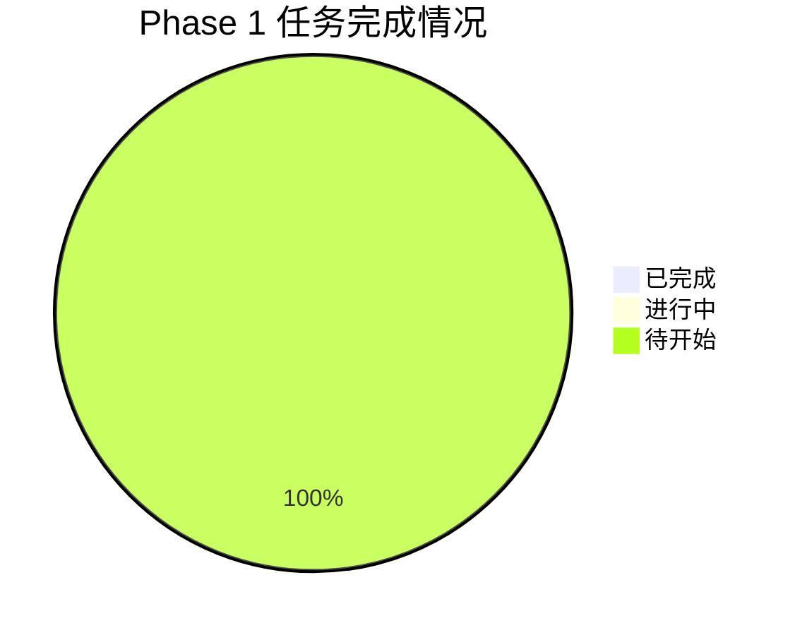

# 进度追踪报告

## 项目信息
- **项目名称**: MGX MVP
- **当前 Phase**: Phase 1 - MVP 核心功能
- **当前 Sprint**: Sprint 1 (Week 1-2)
- **报告周期**: 2024-11-08 ~ 2024-11-15

---

## 本周进度总览

### 整体进度
- **总任务数**: 20
- **已完成**: 0 (0%)
- **进行中**: 0 (0%)
- **待开始**: 20 (100%)
- **本周新增**: 0
- **本周完成**: 0

### 进度图表

---

## 本周完成任务

_本周没有完成的任务_

---

## 进行中任务

_本周没有进行中的任务_

---

## 下周计划

### Sprint 1 任务（Week 1-2）

#### 高优先级任务
1. **TASK-1.1: 项目初始化**
   - 负责人: Alex
   - 预计完成: 2024-11-11
   - 状态: 待开始
   - 关键交付物:
     - [ ] 项目目录结构
     - [ ] docker-compose.yml
     - [ ] .env.example
     - [ ] Makefile 和启动脚本
     - [ ] GitHub Actions CI/CD 配置

2. **TASK-1.2: 数据库模型和迁移**
   - 负责人: David
   - 预计完成: 2024-11-15
   - 状态: 待开始
   - 依赖: TASK-1.1
   - 关键交付物:
     - [ ] 所有数据库模型文件
     - [ ] Alembic 迁移脚本
     - [ ] 数据库初始化脚本

3. **TASK-1.4: Session Manager 和 Context Store**
   - 负责人: Bob
   - 预计完成: 2024-11-15
   - 状态: 待开始
   - 依赖: TASK-1.1
   - 关键交付物:
     - [ ] SessionManager
     - [ ] Context 类
     - [ ] ContextStore

#### 中优先级任务
4. **TASK-1.3: 认证系统和中间件**
   - 负责人: Alex
   - 预计完成: 2024-11-18
   - 状态: 待开始
   - 依赖: TASK-1.1, TASK-1.2

---

## 遇到的问题

### 阻塞问题
_当前没有阻塞问题_

### 风险问题
_当前没有风险问题_

### 需要支持
_当前没有需要支持的问题_

---

## 关键指标

### 时间指标
| 指标 | 计划 | 实际 | 偏差 |
|------|------|------|------|
| Sprint 1 开始日期 | 2024-11-08 | 2024-11-08 | 0天 |
| Sprint 1 结束日期 | 2024-11-22 | - | - |
| 累计工作日 | 0天 | 0天 | 0天 |

### 任务指标
| 指标 | 数量 | 百分比 |
|------|------|--------|
| 计划任务 | 4 | 100% |
| 已完成任务 | 0 | 0% |
| 进行中任务 | 0 | 0% |
| 待开始任务 | 4 | 100% |
| 延期任务 | 0 | 0% |

### 人员指标
| 成员 | 分配任务 | 完成任务 | 进行中 | 工作负载 |
|------|----------|----------|--------|----------|
| Alex | 2 | 0 | 0 | 8天 |
| Bob | 1 | 0 | 0 | 5天 |
| David | 1 | 0 | 0 | 4天 |

---

## 里程碑进度

### Sprint 1 里程碑（Week 1-2）
- [ ] 项目初始化完成
- [ ] 数据库模型和迁移完成
- [ ] 认证系统和中间件完成
- [ ] Session Manager 完成
- **目标日期**: 2024-11-22
- **当前状态**: 未开始
- **完成度**: 0%

### Phase 1 里程碑（Week 10）
- [ ] 完整的 6 人 Agent 团队
- [ ] 基础聊天界面和流式输出
- [ ] 代码编辑器和文件管理
- [ ] 预览功能
- [ ] GitHub 集成
- [ ] WebSocket 鉴权
- **目标日期**: 2025-01-17
- **当前状态**: 未开始
- **完成度**: 0%

---

## 代码质量指标

### 测试覆盖率
| 模块 | 单元测试 | 集成测试 | 目标 |
|------|----------|----------|------|
| Backend | 0% | 0% | 80% |
| Frontend | 0% | 0% | 80% |
| **总计** | **0%** | **0%** | **80%** |

### 代码审查
| 指标 | 数量 |
|------|------|
| 待审查 PR | 0 |
| 已审查 PR | 0 |
| 平均审查时间 | - |

---

## 下周重点工作

### 1. 启动 Sprint 1 开发
- Alex 开始 TASK-1.1（项目初始化）
- 确保 Docker 环境正确配置
- 完成项目目录结构搭建

### 2. 并行开发准备
- David 准备数据库模型设计
- Bob 准备 Session Manager 架构设计
- 确保 TASK-1.1 完成后可以立即并行开发

### 3. 技术调研
- 确认 LangChain 版本和 API
- 确认 Qdrant 向量数据库配置
- 确认 Redis Streams 使用方式

---

## 团队协作

### 本周会议
- [ ] 周一: Sprint Planning（2024-11-11）
- [ ] 周三: 技术讨论会（2024-11-13）
- [ ] 周五: 进度同步会（2024-11-15）

### 沟通记录
_本周没有沟通记录_

---

## 备注

### 重要提醒
1. TASK-1.1 是所有任务的基础，必须优先完成
2. 确保 Docker 环境在本地和 CI/CD 中都能正常运行
3. 数据库模型设计需要仔细审查，避免后期大规模修改

### 下周关注点
1. TASK-1.1 的完成质量
2. TASK-1.2 和 TASK-1.4 的并行开发效率
3. 团队成员的工作负载平衡

---

## 更新日志
| 日期 | 更新内容 | 更新人 |
|------|---------|--------|
| 2024-11-08 | 创建进度追踪报告模板 | Emma |

---

## 下次更新
**日期**: 2024-11-15  
**内容**: 本周进度总结和下周计划