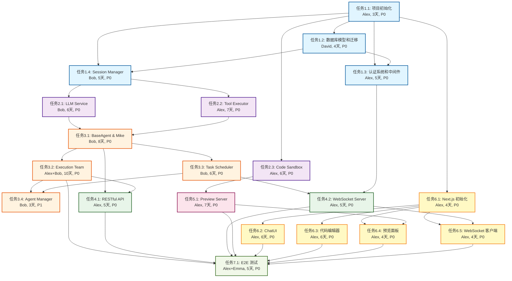

# 任务依赖关系图

## Phase 1 任务依赖关系



---

## 关键路径分析

### 主关键路径（最长路径）
```
TASK-1.1 (3天)
  → TASK-1.2 (4天)
    → TASK-1.4 (5天)
      → TASK-2.1 (6天)
        → TASK-3.1 (8天)
          → TASK-3.2 (10天)
            → TASK-7.1 (5天)

总计: 41天
```

### 次关键路径
```
TASK-1.1 (3天)
  → TASK-2.3 (6天)
    → TASK-5.1 (7天)
      → TASK-6.4 (4天)
        → TASK-7.1 (5天)

总计: 25天
```

---

## 并行任务机会

### Sprint 1 并行任务
- **TASK-1.2** 和 **TASK-1.4** 可以在 TASK-1.1 完成后并行开发
- 预计可节省 **4天**

### Sprint 2 并行任务
- **TASK-2.1** 和 **TASK-2.2** 可以在 TASK-1.4 完成后并行开发
- **TASK-2.3** 可以在 TASK-1.1 完成后独立开发
- 预计可节省 **6-7天**

### Sprint 6 并行任务
- **TASK-6.2**, **TASK-6.3**, **TASK-6.4**, **TASK-6.5** 可以在 TASK-6.1 完成后并行开发
- 预计可节省 **16天**

---

## 依赖关系说明

### 基础设施依赖
所有任务都依赖 **TASK-1.1（项目初始化）**，这是整个项目的基础。

### 数据库依赖
- **TASK-1.3（认证系统）** 依赖 **TASK-1.2（数据库模型）**
- **TASK-1.4（Session Manager）** 依赖 **TASK-1.2（数据库模型）**

### LLM 和工具依赖
- **TASK-3.1（BaseAgent & Mike）** 依赖 **TASK-2.1（LLM Service）** 和 **TASK-2.2（Tool Executor）**

### Agent 系统依赖
- **TASK-3.2（Execution Team）** 依赖 **TASK-3.1（BaseAgent & Mike）**
- **TASK-3.3（Task Scheduler）** 依赖 **TASK-3.1（BaseAgent & Mike）**
- **TASK-3.4（Agent Manager）** 依赖 **TASK-3.2** 和 **TASK-3.3**

### API 依赖
- **TASK-4.1（RESTful API）** 依赖 **TASK-3.1** 和 **TASK-3.2**
- **TASK-4.2（WebSocket Server）** 依赖 **TASK-1.3（认证系统）** 和 **TASK-3.3（Task Scheduler）**

### 前端依赖
- 所有前端任务都依赖 **TASK-6.1（Next.js 初始化）**
- **TASK-6.4（预览面板）** 额外依赖 **TASK-5.1（Preview Server）**
- **TASK-6.5（WebSocket 客户端）** 额外依赖 **TASK-4.2（WebSocket Server）**

### 测试依赖
- **TASK-7.1（E2E 测试）** 依赖所有核心功能完成

---

## 风险点识别

### 高风险任务（关键路径上的复杂任务）
1. **TASK-3.2（Execution Team）**: 10天，涉及5个Agent的实现
2. **TASK-3.1（BaseAgent & Mike）**: 8天，核心架构设计
3. **TASK-2.2（Tool Executor）**: 7天，多个工具的集成
4. **TASK-5.1（Preview Server）**: 7天，涉及Docker和nginx配置

### 阻塞风险
- **TASK-1.1** 延期会影响所有任务
- **TASK-3.1** 延期会影响整个Agent系统
- **TASK-6.1** 延期会影响所有前端任务

### 资源冲突
- Alex 负责 11 个任务，工作量最大，可能成为瓶颈
- Sprint 1 和 Sprint 2 的任务较多，需要合理分配

---

## 优化建议

### 1. 增加并行开发
- Sprint 1: TASK-1.2 和 TASK-1.4 并行
- Sprint 2: TASK-2.1, TASK-2.2, TASK-2.3 并行
- Sprint 6: 所有前端任务并行

### 2. 提前启动独立任务
- **TASK-2.3（Code Sandbox）** 可以在 Sprint 1 完成后立即开始
- **TASK-6.1（Next.js 初始化）** 可以在 Sprint 1 完成后立即开始

### 3. 增加人力资源
- 考虑为 Alex 分担部分任务
- 可以让 David 或 Iris 参与前端开发

### 4. 设置里程碑检查点
- Sprint 1 结束: 基础设施验收
- Sprint 3 结束: Agent 系统验收
- Sprint 6 结束: 前端功能验收

---

## 图例说明

- **蓝色**: Sprint 1 任务（基础设施）
- **紫色**: Sprint 2 任务（LLM和工具）
- **橙色**: Sprint 3 任务（Agent系统）
- **绿色**: Sprint 4 任务（API和WebSocket）
- **粉色**: Sprint 5 任务（预览服务器）
- **黄色**: Sprint 6 任务（前端）
- **浅绿**: Sprint 7 任务（测试）